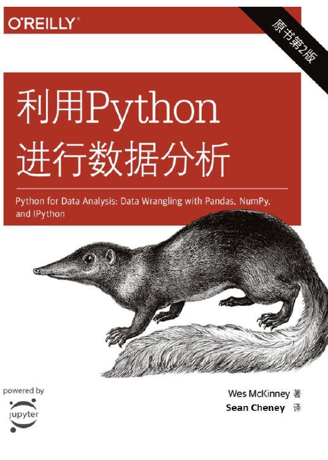

# Python-for-Data-Analysis-2nd

**Data Analysis for Team Learning in the 7th Term of Datawhale.**

## Task 0

- **Github** + **JupyterNotebook** 的使用

## Task 1

- **Numpy** + Related-work

## Task 2

- **Pandas** + **数据载入**

## Task 3

- **数据清洗** + **数据融合**

## Task 4

- **数据聚合** + **Pandas 进阶** + Related-work

## Task 5

- **Matplotlib** + Related-work

## Task 6

- **时间序列**

## Task 7

- **大作业** + **总结**
